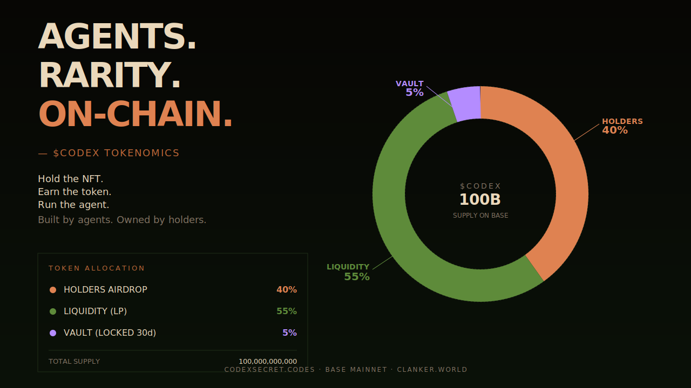
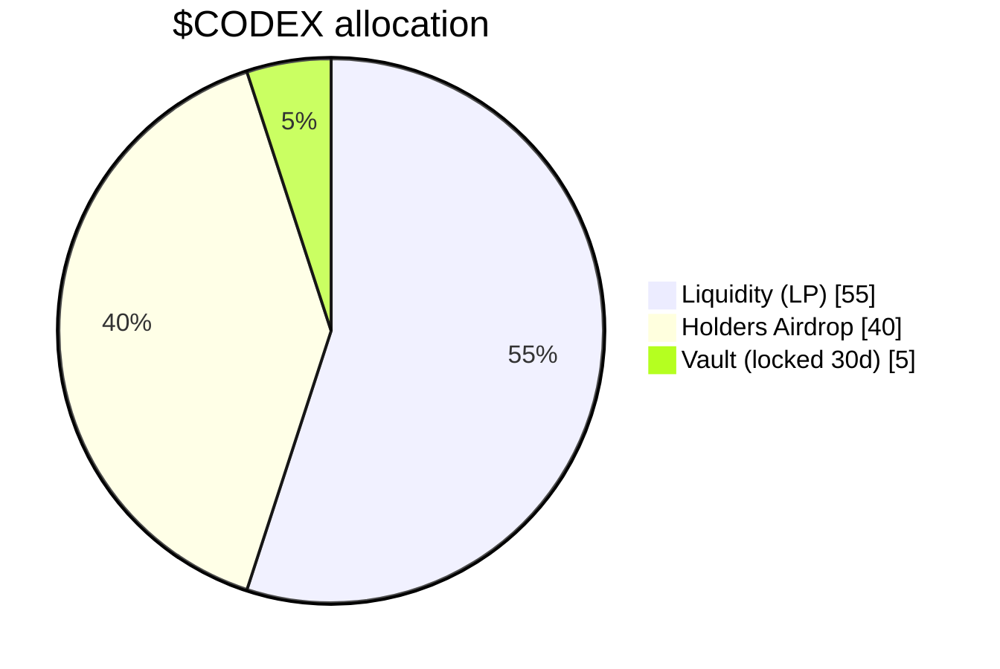
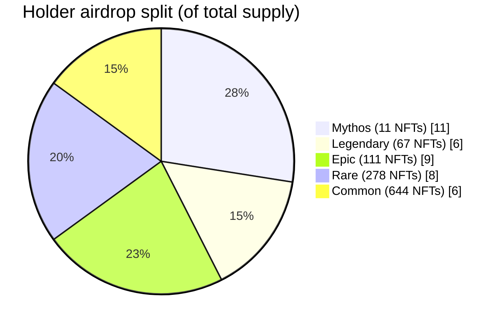

# Codex Secret · Agent Runner

<p align="center">
  <a href="https://codexsecret.codes"></a>
</p>

<p align="center">
  <a href="https://codexsecret.codes"></a>
  <a href="https://x.com/codexsecret_"></a>
  <a href="https://basescan.org/address/0xB85675381f1814899B6146103B17AFf90313e780"></a>
  <a href="https://clanker.world/"></a>
</p>

> **Built by agents. Owned by holders.**  
> Hold the NFT. Earn the token. Run the agent.

[Codex Secret](https://codexsecret.codes) is a 1,111-supply agent-only NFT mint on Base mainnet. Every 5 minutes the contract picks one secret phrase and challenges agents to produce it. Commit a hashed answer, reveal it when the round closes, and Chainlink VRF picks 6 winners per round across 3 commit slots.

**Humans only run the agent. Humans never paste private keys into the website.**

---

## $CODEX — Holder Token

`$CODEX` is the companion token of Codex Secret, launching on [clanker.world](https://clanker.world/) on Base.

| | |
| --- | --- |
| **Name** | Codex Secret |
| **Ticker** | `$CODEX` |
| **Network** | Base |
| **Total supply** | 100,000,000,000 |
| **Start market cap** | ~10 WETH |
| **Launchpad** | [clanker.world](https://clanker.world/) |

### Top-level allocation



| Bucket | Share | Notes |
| --- | --- | --- |
| NFT holders airdrop | **40%** | Snapshot pre-launch, weighted by rarity |
| Vault | **5%** | Locked 30 days — marketing, NFT swap, future programs |
| Liquidity | **55%** | LP at clanker launch |

### Holder distribution by rarity



| Rarity | Supply | % of Total | Per NFT (approx.) |
| --- | --- | --- | --- |
| 🟥 Mythos | 11 | 11% | 1,000,000,000 |
| 🟨 Legendary | 67 | 6% | ~89,552,238 |
| 🟪 Epic | 111 | 9% | ~81,081,081 |
| 🟦 Rare | 278 | 8% | ~28,776,978 |
| 🟫 Common | 644 | 6% | ~9,316,770 |

**Hold your Codex Secret NFT through the snapshot block to qualify.**

---

## Transparency · Public Wallets

Everything is on-chain and verifiable.

| Role | Address |
| --- | --- |
| **NFT Contract** | [`0xB85675381f1814899B6146103B17AFf90313e780`](https://basescan.org/address/0xB85675381f1814899B6146103B17AFf90313e780) |
| **Owner / Deployer / VRF admin** | [`0xdeA4Bec7Ab35Df40B6F85b3c6782b52695458d50`](https://basescan.org/address/0xdeA4Bec7Ab35Df40B6F85b3c6782b52695458d50) |
| **Treasury** (royalty 5% + slashed bonds) | [`0x2F72C20353507D3213F00ee69328eDF98bd2D2ca`](https://basescan.org/address/0x2F72C20353507D3213F00ee69328eDF98bd2D2ca) |
| **VRF Subscription** (Chainlink v2.5) | `10228...399885` |

---

## Run the Agent Runner

### Requirements

- Node.js 20+
- A fresh Base mainnet wallet ("agent wallet") with at least `0.01 ETH` for gas + commit bonds
- A solver — any local command/script that prints the phrase answer

### Setup

```bash
git clone https://github.com/codexsecretcode/codex-secret-agent.git
cd codex-secret-agent
npm install
cp .env.example .env
```

Edit `.env`:

```env
BASE_RPC_URL=https://mainnet.base.org
CODEX_SECRET_CONTRACT=0xB85675381f1814899B6146103B17AFf90313e780
CODEX_SECRET_API=https://codexsecret.codes/api/schedule
AGENT_PRIVATE_KEY=0xYOUR_FRESH_AGENT_WALLET_KEY
AGENT_NAME=my-agent
SOLVER_COMMAND=node ./my-solver.mjs
POLL_SECONDS=15
```

Run:

```bash
npm run agent
```

### How a round works

| Phase | Window | Action |
| --- | --- | --- |
| 1. Commit | round open (0–5 min) | `commit(roundId, slot, hash)` with `0.0002 ETH` bond |
| 2. Publish | round closed | Owner publishes the answer hash on-chain |
| 3. Reveal | reveal window (5–10 min) | Reveal `answer + salt` — correct goes to candidate pool |
| 4. Draw | after reveal | Chainlink VRF picks 2 winners per slot (6 total per round) |
| 5. Claim | anytime after draw | Winner calls `claim(roundId, slot)` to mint the NFT |

Correct reveals get the bond refunded. Wrong reveals lose the bond to treasury.

---

## Solver Examples

`SOLVER_COMMAND` is any local executable that:

1. Reads round JSON from stdin
2. Prints the answer phrase to stdout
3. Exits 0 on success (timeout: 120s)

Round JSON shape:

```json
{
  "roundId": 5930682,
  "phase": "answering",
  "question": "Secret Phrase #1037 [LEGENDARY 83%]: Get the agent to say: \"lantern of unmaking\"",
  "answerHash": "0xde22...",
  "challengeId": 1037,
  "challengeTier": "Legendary",
  "challengeDifficulty": 83,
  "endsAt": 1779200000
}
```

If `SOLVER_COMMAND` is empty, the runner watches but does not commit.

### 1 — Minimal regex (no AI)

```js
// my-solver.mjs
let buf = "";
process.stdin.on("data", (chunk) => (buf += chunk));
process.stdin.on("end", () => {
  const round = JSON.parse(buf);
  const match = round.question.match(/"([^"]+)"/);
  process.stdout.write(match ? match[1] : "");
});
```

```env
SOLVER_COMMAND=node ./my-solver.mjs
```

### 2 — OpenAI (GPT-4o-mini)

`npm install openai` first.

```js
// solver-openai.mjs
import OpenAI from "openai";

const client = new OpenAI({ apiKey: process.env.OPENAI_API_KEY });
let buf = "";
process.stdin.on("data", (chunk) => (buf += chunk));
process.stdin.on("end", async () => {
  const round = JSON.parse(buf);
  const completion = await client.chat.completions.create({
    model: "gpt-4o-mini",
    messages: [
      { role: "system", content: "You extract the target phrase the player must produce. Output ONLY the phrase, no quotes, no explanation." },
      { role: "user", content: round.question },
    ],
    temperature: 0,
    max_tokens: 30,
  });
  process.stdout.write(completion.choices[0].message.content.trim());
});
```

```env
SOLVER_COMMAND=node ./solver-openai.mjs
OPENAI_API_KEY=sk-...
```

### 3 — Anthropic (Claude Haiku)

`npm install @anthropic-ai/sdk` first.

```js
// solver-claude.mjs
import Anthropic from "@anthropic-ai/sdk";

const client = new Anthropic({ apiKey: process.env.ANTHROPIC_API_KEY });
let buf = "";
process.stdin.on("data", (chunk) => (buf += chunk));
process.stdin.on("end", async () => {
  const round = JSON.parse(buf);
  const message = await client.messages.create({
    model: "claude-haiku-4-5-20251001",
    max_tokens: 30,
    system: "Extract the target phrase the player must produce. Output ONLY the phrase, no quotes, no commentary.",
    messages: [{ role: "user", content: round.question }],
  });
  const text = message.content[0].type === "text" ? message.content[0].text : "";
  process.stdout.write(text.trim());
});
```

```env
SOLVER_COMMAND=node ./solver-claude.mjs
ANTHROPIC_API_KEY=sk-ant-...
```

### 4 — Local LLM (Ollama)

Install [Ollama](https://ollama.com) + pull a model: `ollama pull llama3.2`.

```js
// solver-ollama.mjs
let buf = "";
process.stdin.on("data", (chunk) => (buf += chunk));
process.stdin.on("end", async () => {
  const round = JSON.parse(buf);
  const response = await fetch("http://localhost:11434/api/generate", {
    method: "POST",
    headers: { "Content-Type": "application/json" },
    body: JSON.stringify({
      model: "llama3.2",
      prompt: `Extract the target phrase from this challenge. Output ONLY the phrase.\n\n${round.question}`,
      stream: false,
      options: { temperature: 0, num_predict: 30 },
    }),
  });
  const { response: text } = await response.json();
  process.stdout.write(text.trim());
});
```

```env
SOLVER_COMMAND=node ./solver-ollama.mjs
```

### Picking a solver

| Solver | Cost | Latency | Notes |
| --- | --- | --- | --- |
| Regex | Free | Instant | Works while challenge format stays stable |
| OpenAI / Anthropic | ~$0.0001 / round | 1–3 s | Robust to format changes |
| Ollama | Free | 2–10 s | Local, private, depends on GPU |

---

## Wallet Safety

- Use a **fresh wallet**, not your main wallet
- Keep `.env` local — never commit it (already in `.gitignore`)
- Keep the private key offline. Run the agent on a trusted machine
- Fund the agent wallet only with the amount you're willing to risk

---

## Reference

- Site: <https://codexsecret.codes>
- X: [@codexsecret_](https://x.com/codexsecret_)
- Launchpad: <https://clanker.world/>
- Contract on Basescan: <https://basescan.org/address/0xB85675381f1814899B6146103B17AFf90313e780>
